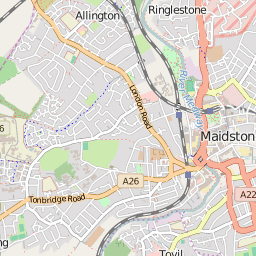

# area51-fileserver

A simple Docker enabled https server utilising our java nio [FileSystem](https://github.com/peter-mount/filesystem) and [HTTPD](https://github.com/peter-mount/httpd) components.

Currently it supports just serving content but (near) future versions will include:
* ACL control of content
* Write support
* HTTPS support

## Configuration

The image requires one configuration file in the etc directory (see CONFIGURATION_DIR below). This file is fileserver.json and defines the http server.
```json
{
    "filesystems": ["test"],

    "filesystem": {
        "test": {
            "uri":"local://test",
            "prefix":"test"
        }
    }
}
```
* filesystems is a json list of file system names, one for each file system to mount.
* filesystem is a json object containing an object for each filesystem. A file system is optional here, you can also have it located in an external file - more later.

Each file system consists of a minimum of two values:
* uri - the FileSystem URI which will be used to mount the file system within Java NIO-2.
* prefix - this is the path prefix exposed within the server. All files within the filesystem will be served from /prefix/ root on the server.

So in the example above the "test" filesystem will mount the URI "local://test" and all files within it will be served from `http://host:8080/test/` url (

### HTTPD configuration
This is done within the "httpd" entry within the main json object. There's too many to write on this page but the main one is port (which defaults to 8080)
```json
{
    "filesystems": ["test"],

    "httpd": {
        "port": 80
    }
}
```

### External FileSystem configuration

You don't have to put every file system into the core file. Instead you can create a .json file for each one using the filesystem's name. This file is placed under the filesystem subdirectory of the one containing fileserver.json and has the same structure as the object in the main file:

For example:
```json
{
    "filesystems": ["test"],
}
```

and filesystem/test.json:
``` json
{
    "uri":"local://test",
    "prefix":"test"
}
```

## Docker Image

The image supports a few environment variables:
Environment Variable | Default value | Purpose
-------------------- | ------------- | -------
CONFIGURATION_DIR | /opt/fileserver/etc | the location in the image of the configuration files
FILESYSTEM_BASE | /opt/fileserver/data | the location in the image of where the filesystems are stored
AWS_CREDENTIAL_PROFILES_FILE | /opt/fileserver/etc/.aws | the location of the AWS credentials. Only required if proxying S3 buckets.
PREFER_IPv6_ADDRESSES | _not defined_ | Set if you want the fileserver to prefer IPv6 addresses when performing DNS lookups. This is the equivalent of passing -Djava.net.preferIPv6Addresses=true to the JVM.
TIMEZONE | time zone of host | Set the timezone of the server
RUNJDWP | _not defined_ | If set the port to listen for a debugger to attach. The server will not start until the debugger attaches if this is set

To be of any use you will need to mount the CONFIGURATION_DIR and FILESYSTEM_BASE directories to either directories on the host or to a docker volume container for the file server to be of any use. If you don't set those values then use the defaults

**Note:** Here we use -p 8080:8080 to expose the server on the host. If you use direct routing to the container (which I do as I have each container with it's own Global IPv6 static address) you can leave that parameter out.
### Run in the background using host directory mounts:
```java
docker run -d \
    -v /path/fileserver/etc:/opt/fileserver/etc \
    -v /path/fileserver/etc:/opt/fileserver/filesystem \
    -p 8080:8080 \
    area51/fileserver
```

### Run on the console (useful in development):
```java
docker run -it --rm \
    -v /path/fileserver/etc:/opt/fileserver/etc \
    -v /path/fileserver/etc:/opt/fileserver/filesystem \
    -p 8080:8080 \
    area51/fileserver
```
You can ^C this to stop it.

### Poking around
If you want to poke around the container, then you can use the following to get a shell:
```java
docker run -it --rm \
    -v /path/fileserver/etc:/opt/fileserver/etc \
    -v /path/fileserver/etc:/opt/fileserver/filesystem \
    -p 8080:8080 \
    area51/fileserver \
    /bin/ash
```
When poking around to start the server run /opt/fileserver/fileserver and you can use ^C to stop and return to the ash shell. ^D to exit the container.

## Advanced configuration

As an advanced configuration, here's how to create a simple Map Tile proxy to OpenStreetMap.

```json
{
    "filesystems": ["tiles"],

    "filesystem": {
	"tiles": {
	    "name":"tiles",
	    "uri":"cache://tiles",
	    "prefix":"tiles",
	    "environment": {
		"fileSystemType":"cache",
		"remoteUrl": "http://c.tile.openstreetmap.org/",
		"fileSystemWrapper": "http",
		"maxAge": 172800000,
		"scanDelay": 3600000,
		"expireOnStartup": true
	    }
	}
    },
}
```

Now running this and running wget against it:
``` java
wget http://127.0.0.1:8080/tiles/13/4107/2732.png -O 2732.png
```

You end up with:


Now once an hour (scanDelay) it will look for entries that are 2 days old (maxAge) and remove them. Until then it will serve it's local copy, so we only hit the remote server just once.

## Proxying S3 buckets

You can now proxy a Amazon S3 bucket. This is simply a filesystem with an S3 bucket configured as the remote file store.

The minimum environment entries you need are: fileSystemWrapper set to s3read and bucket containing your bucket name. Like the previous example you can set the cache expiry settings. If an entry is expired then it will go back to S3 to retrieve the object.

```json
{
    "filesystems": ["bucket"],

    "filesystem": {
	"bucket": {
	    "name":"bucket",
	    "uri":"cache://bucket",
	    "prefix":"bucket",
	    "environment": {
		"fileSystemWrapper": "s3read",
		"bucket": "my.bucket"
	    }
	}
    },
}
```

You also need to put your AWS credentials in the .aws file within the config directory.

Now running this and running wget against it:
``` java
wget http://127.0.0.1:8080/bucket/someobject -O someobject
```

You will then retrieve that object from Amazon S3, but it will now be cached locally. This is useful as it costs to retrieve an object from S3, so it can save you money by providing a local cache of regularly used objects.
